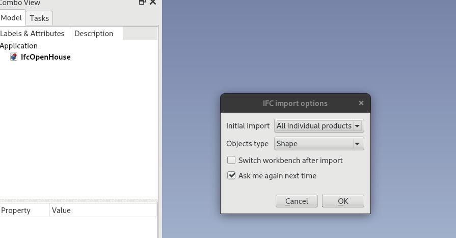
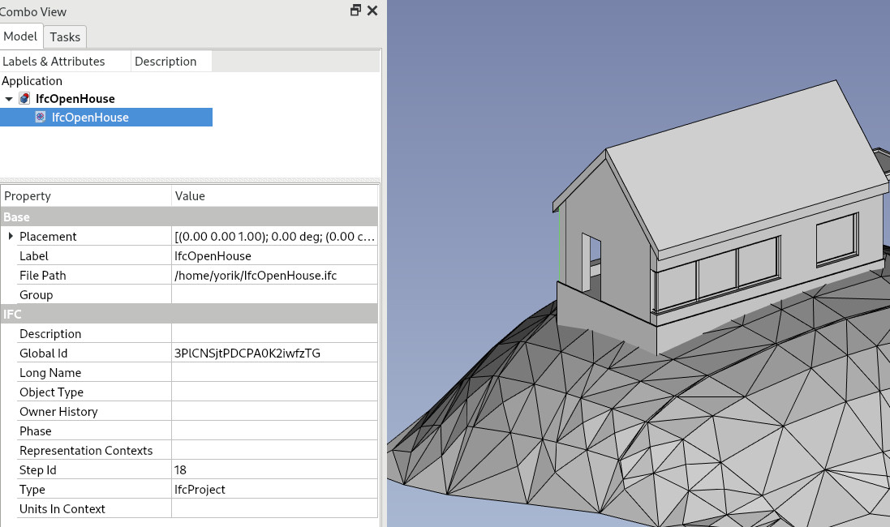
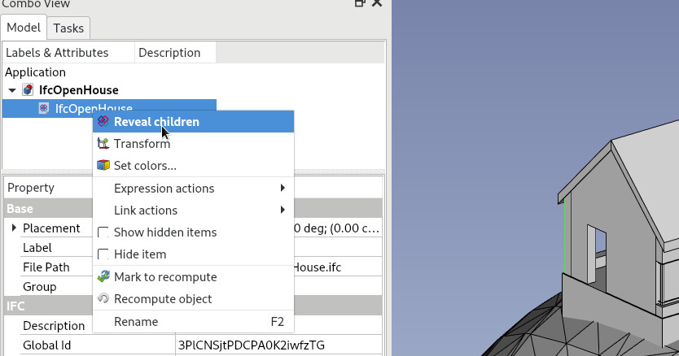
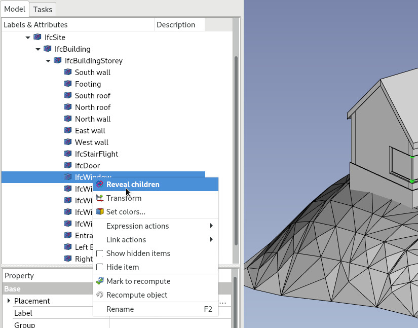
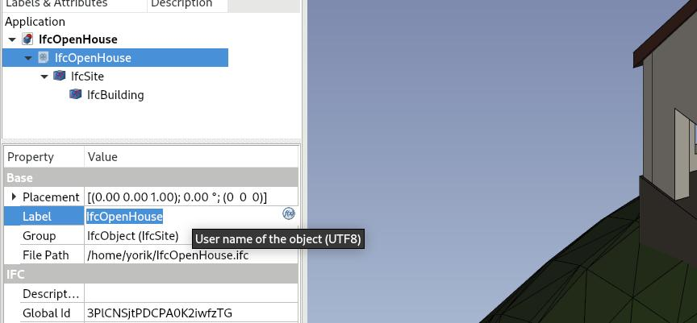
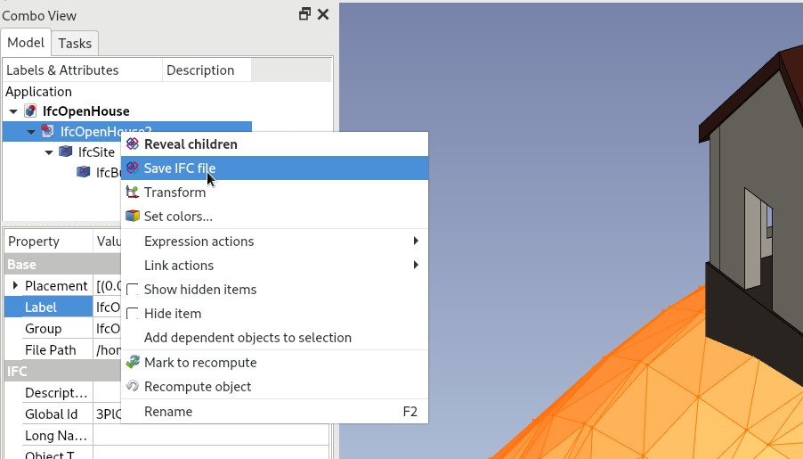
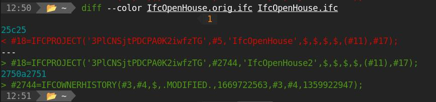

## NativeIFC addon for FreeCAD

This is a preliminary stub to integrate [BlenderBIM](https://blenderbim.org) into [FreeCAD](https://freecad.org). The final goal is to offer in FreeCAD the same level of functionality found in BlenderBIM, mainly the native handling of IFC files, which means the data manipulation in FreeCAD is affecting directly the IFC model.

### Roadmap

#### 1. Get a working concept up

* [x] Write an importer that allows an initial import of an IFC file into FreeCAD
* [x] Write a custom parametric FreeCAD object that represents an IFC document in the FreeCAD tree
* [x] Do an initial geometry import
* [x] Write a custom parametric FreeCAD object that represents in IFC product in the FreeCAD tree
* [x] Reveal the document structure in the FreeCAD tree
* [x] Allow an object shape to be built automatically from its children
* [x] Allow to expand a document (reveal its children)
* [x] Use group extension
* [x] Support colors

#### 2. Allow basic editing

* [x] Use enums in enum-based properties
* [ ] ~~Fetch attribute documentation~~ canceled for now because it yields too much text
* [x] Fetch context-dependent IFC types
* [x] Find a way to not store the whole enum in the file
* [x] Add progress feedback
* [x] Allow to change an attibute of an object
* [x] Allow to manually save the linked IFC file
* [x] Implement mesh mode
* [x] Allow different storage strategies (full shape or only coin representation)
* [ ] Write a hook system that allows FreeCAD to save the IFC document
* [ ] Test (and solve!) what happens when opening a NativeIFC file in vanilla FreeCAD
* [x] Add a shape caching system
* [x] Allow to change the class of an object

#### 3. Allow adding new objects

* [x] Allow different import strategies (full model, only building structure...)
* [ ] Allow to create an IFC document without an existing IFC file
* [ ] Allow to add building structure (building, storey...)
* [ ] Allow to add a simple generic IFC product

#### 4. Allow advanced editing

* [ ] Define a strategy for expanding non-IfcProduct elements
* [ ] Expand attributes
* [ ] Expand materials
* [ ] Expand properties
* [ ] Allow to regroup elements

### Installation

#### Auto install

*The advantage of this approach is the ability to update FreeCAD-BlenderBIM workbench via the addon manager.*

* Open the [Addon Manager preferences](https://wiki.freecad.org/Preferences_Editor#Addon_Manager) via `Edit` → `Preferences` → `Addon Manager` → `Custom Repositories`
* Add `https://github.com/yorikvanhavre/FreeCAD-NativeIFC` to `Custom Repositories` list. In the `Branch` section indicate the `main` branch. Press `OK`.
* Start the `Tools` → `Addon Manager` which will automatically find FreeCAD-NativeIFC addon in the workbench list.
* Install FreeCAD-NativeIFC addon
* Restart FreeCAD
  **Result:** FreeCAD-NativeIFC importer should be available in open/insert file dialogs

#### Manual install

* Navigate to your FreeCAD Mods folder (`~/.local/share/FreeCAD/Mods`)
* Clone this repo there: `git clone https://github.com/yorikvanhavre/FreeCAD-NativeIFC.git`
* Restart FreeCAD
  **Result:** FreeCAD-NativeIFC importer should be available in open/insert file dialogs

### Usage

The workflow below allows to test what works already (refer to the above list to know what has been implemented):

* Install the addon as described above
* Restart FreeCAD
* `File` → `Open` or `File` → `Insert`, select an IFC file
* Select the Native IFC importer


* Set the desired options



* A FreeCAD document is created
* An object is created representing the IFC root document + project



* Right-click the IFC root document object and select **Expand**



* A site object, or any other child object is created. You can further expand those children



* Try changing one parameter, for ex the **Label** properry of an object



* When any attribute of the linked IFC file has changed, the icon of the IFC document object shows a red dot, and a **save** option becomes available when right-clicking it



* After saving, only the changed parameters have changed in the linked IFC file



### Notes

#### Documentation

* [IfcOpenShell github](https://github.com/IfcOpenShell/IfcOpenShell)
* [IfcOpenShell docs](https://blenderbim.org/docs-python/ifcopenshell.html)
* [BlenderBIM docs](https://blenderbim.org/docs/)
* [IfcOpenShell matrix structure](https://github.com/IfcOpenShell/IfcOpenShell/issues/1440)
* [IfcOpenShell to FreeCAD matrix conversion](https://pythoncvc.net/?cat=203)

#### Code examples

Initial import + getting the main file structure:

```python
import ifcopenshell
ifcfile = ifcopenshell.open("IfcOpenHouse.ifc")
project = ifcfile.by_type("IfcProject")[0]
# get descendants (site, building, and everything inside)
entitieslist = ifcopenshell.util.element.get_decomposition(project)
```

Using the geometry iterator:

```python
from ifcopenshell import geom
import multiprocessing
settings = ifcopenshell.geom.settings()
settings.set(settings.DISABLE_TRIANGULATION, True)
settings.set(settings.USE_BREP_DATA,True)
settings.set(settings.SEW_SHELLS,True)
settings.set(settings.USE_WORLD_COORDS,True)
settings.set(settings.APPLY_LAYERSETS,True)
shapes = []
colors = []
cores = multiprocessing.cpu_count()-2
iterator = ifcopenshell.geom.iterator(settings, ifcfile, cores, include=entitieslist)
iterator.initialize()
while True:
    item = iterator.get()
    if item:
        ifcproduct = ifcfile.by_id(item.guid)
        brep = item.geometry.brep_data
        shape = Part.Shape()
        shape.importBrepFromString(brep, False)
        shape.scale(1000.0) # IfcOpenShell outputs in meters
        shapes.append(shape)
        colors.append(item.geometry.surface_styles)
    if not iterator.next():
        break
compound = Part.makeCompound(shapes)
```

Change a parameter of an object

```python
cmd = 'attribute.edit_attributes'
prod = ifcfile.by_type["IfcWall"][0]
attribs = {"Name": "Foo"}
ifcopenshell.api.run(cmd, ifcfile, product=prod, attributes=attribs)
```

Working with classes and types:

```python
# getting supertypes for types
>>> ifcopenshell.util.type.get_applicable_types("IfcWall")
['IfcWallType']
>>> ifcopenshell.util.type.get_applicable_entities("IfcWallType")
['IfcWall', 'IfcWallElementedCase', 'IfcWallStandardCase']
```

Working with schema classes:

```python
schema = ifcopenshell.ifcopenshell_wrapper.schema_by_name('IFC4')
declaration = schema.declaration_by_name('IfcWall')
print(declaration.supertype())
for subtype in declaration.supertype().subtypes():
    print(subtype.name())
```

Working with documentation:

```python
entdoc = ifcopenshell.util.doc.get_entity_doc("IFC4","IfcWall")
entdoc.keys() # 'description', 'predefined_types', 'spec_url', 'attributes'
entdoc['attributes']['IsDefinedBy']
# gives the same result as
ifcopenshell.util.doc.get_attribute_doc("IFC4","IfcWall","IsDefinedBy")
# 'Set of relationships to the object type that provides the type definitions 
# for this object occurrence. The then associated _IfcTypeObject_, or its subtypes,
# contains the specific information (or type, or style), that is common to all 
# instances of _IfcObject_, or its subtypes, referring to the same type.'
```

Change class

```python
>>> f=ifcopenshell.open("IfcOpenHouse.ifc")
>>> w=f.by_type("IfcWall")[0]
>>> w
#40=IfcWallStandardCase('1TGeFqjqb3$xFeUl92Fwvi',#5,'South wall',$,$,#61,#43,$)
>>> ifcopenshell.util.schema.reassign_class(f,w,"IfcBeam")
#2746=IfcBeam('1TGeFqjqb3$xFeUl92Fwvi',#5,'South wall',$,$,#61,#43,$)
>>> f.write("IfcOpenHouse2.ifc")
```

### Performance

| File                                                                                                                                                    | File size | Import time (shape) | Import time (coin) | BlenderBIM |
| ------------------------------------------------------------------------------------------------------------------------------------------------------- | --------- | ------------------- | ------------------ | ---------- |
| [IfcOpenHouse](https://github.com/aothms/IfcOpenHouse)                                                                                                  | 0.1Mb     | < 1s                | < 1s               | < 1s       |
| [AC20 FCK Haus](https://www.ifcwiki.org/images/e/e3/AC20-FZK-Haus.ifc)                                                                                  | 2.6Mb     | 2s                  | 1s                 | 1s         |
| [Schultz residence](https://github.com/OpeningDesign/Schultz_Residence/tree/master/Model)                                                               | 22Mb      | 27s                 | 6s                 | 5s         |
| [King Street simplified](http://www.simaud.org/datasets/)                                                                                               | 26Mb      | 1m17s               | 34s                | 14s        |
| [Schependomlaan](https://github.com/buildingSMART/Sample-Test-Files/blob/master/IFC%202x3/Schependomlaan/Design%20model%20IFC/IFC%20Schependomlaan.ifc) | 49Mb      | 21s                 | 6s                 | 5s         |
| [King Street full](http://www.simaud.org/datasets/)                                                                                                     | 155b      | Fails               | 46s                | 36s        |
| [Nineteen plots](https://forum.freecadweb.org/viewtopic.php?style=1&p=646935&sid=464a4dcd0f99a5903c749df51f3e73b0#p646935)                              | 4.3Mb     | Untested            | 10s                | 4s         | 

Coin mode gives same values as Mesh mode, and is therefore not interesting at this point...
