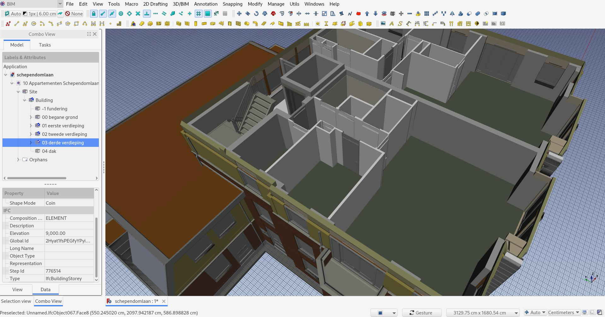

## NativeIFC addon for FreeCAD

This project implements [NativeIFC](https://github.com/brunopostle/ifcmerge/blob/main/docs/whitepaper.rst) concept into [FreeCAD](https://freecad.org). It allows FreeCAD users to open, manipulate and create [IFC](https://en.wikipedia.org/wiki/Industry_Foundation_Classes) files natively in FreeCAD.

Although FreeCAD already supports opening and saving IFC files through the [Arch workbench](https://wiki.freecad.org/Arch_Workbench), it does so, like most other BIM applications, by translating to and from the IFC file format and FreeCAD's internal data model. This means two translations, one when opening and another one when saving, which cause a) data loss, and b) a complete rewrite of the file, which turns it unsuitable for [version control systems](https://en.wikipedia.org/wiki/Version_control) like [Git](https://en.wikipedia.org/wiki/Git).

NativeIFC means that the IFC file is itself the data structure in FreeCAD. When opening an IFC file in FreeCAD, what you see on the screen is a direct reflection of the contents of the IFC file. Anything you modify will directly modify the IFC file. If you open a file, modify one element and save the file, the only thing that will have changed in the file is the line concerning that element. The rest of the file will be 100% identical to how it was before you saved. No data loss, and very identificable changes.

This project is heavily inspired by [BlenderBIM](https://blenderbim.org) into [FreeCAD](https://freecad.org) and tries as much as possible to use the same concepts and reuse the code. The final goal is to offer in FreeCAD the same level of functionality and performance found in BlenderBIM, and to upstream as much as possible to [IfcOpenShell](https://ifcopenshell.org), the common IFC engine used by both applications.

The roadmap below will show you an overview of the current state of the implementation. Check the [documentation](doc/README.md) to learn how to use this addon, and I also write regular updates on this project at https://yorik.uncreated.net/blog/nativeifc

### Roadmap

#### 1. Get a working concept up

* [x] Write an importer that allows an initial import of an IFC file into FreeCAD
* [x] Write a custom parametric FreeCAD object that represents an IFC document in the FreeCAD tree
* [x] Do an initial geometry import
* [x] Write a custom parametric FreeCAD object that represents in IFC product in the FreeCAD tree
* [x] Reveal the document structure in the FreeCAD tree
* [x] Allow an object shape to be built automatically from its children
* [x] Allow to expand a document (reveal its children)
* [x] Use group extension
* [x] Support colors

#### 2. Allow basic editing

* [x] Use enums in enum-based properties
* [ ] ~~Fetch attribute documentation~~ canceled for now because it yields too much text
* [x] Fetch context-dependent IFC types
* [x] Find a way to not store the whole enum in the file
* [x] Add progress feedback
* [x] Allow to change an attribute of an object
* [x] Allow to manually save the linked IFC file
* [x] Implement mesh mode
* [x] Allow different storage strategies (full shape or only coin representation)
* [x] Write a hook system that allows FreeCAD to save the IFC document
* [x] Test (and solve!) what happens when opening a NativeIFC file in vanilla FreeCAD
* [x] Add a shape caching system
* [x] Tie the shape caching to the corresponding IFC document
* [x] Allow to change the class of an object
* [x] Allow late loading/rebuilding of coin representation

#### 3. Allow adding and removing objects

* [x] Allow different import strategies (full model, only building structure...)
* [x] Allow to create an IFC document without an existing IFC file
* [x] Allow to add building structure (building, storey...)
* [x] Allow to add a simple generic IFC product
* [x] Allow to delete objects
* [x] Allow to hide children of an object
* [ ] ~~Tie all of the above to BIM commands~~ cancelled because the only one necesary is the Project tool

#### 4. Allow advanced editing

* [x] Allow to edit placements
* [x] Define a strategy for expanding non-IfcProduct elements
* [ ] ~~Expand attributes~~ cancelled for now because only non-link attributes need to be shown so far
* [ ] Expand materials
* [x] Expand properties
* [ ] Allow to regroup elements
* [x] Handle drag/drop
* [ ] Handle undo/redo
* [x] Allow to change the IFC schema
* [ ] Support layers
* [ ] Support groups

#### 5. Full workflow (creation and edition) of different tools

* [x] Support Arch walls
* [x] Support Arch structures
* [ ] Support Arch objects with subtractions and additions
* [x] Support Arch windows
* [ ] Support custom openings and protrusions
* [ ] Support Draft 2D entitties
* [ ] Support Draft dimensions
* [x] Support Part extrusions
* [ ] Support Part booleans

#### Additionals

* [ ] Add this to the addons manager
* [ ] Add to BIM WB dependencies/ reorganize addon
* [ ] Verify and adapt 2D view generation workflow
* [ ] Verify and adapt quantifying workflow
* [ ] Document everything
* [ ] Upstream all pure ifcopenshell functionality to ifcopenshell.utils
* [ ] Transfer Arch exportIFC.getRepresentation() functionality to ifcopenshell.api.geometry

#### Further goals

* [ ] Support Types
* [ ] Support quantity sets
* [ ] Support mapped geometry
* [ ] Wall joining system

### Documentation

* [Installing](doc/installation.md)
* [Usage](doc/README.md)
* [IfcOpenShell code examples](doc/code_examples.md)
* [IfcOpenShell github](https://github.com/IfcOpenShell/IfcOpenShell)
* [IfcOpenShell docs](https://blenderbim.org/docs-python/ifcopenshell.html)
* [BlenderBIM docs](https://blenderbim.org/docs/)
* [IfcOpenShell matrix structure](https://github.com/IfcOpenShell/IfcOpenShell/issues/1440)
* [IfcOpenShell to FreeCAD matrix conversion](https://pythoncvc.net/?cat=203)

### Performance

| File                                                                                                                                                    | File size | Import time (shape) | Import time (coin) | BlenderBIM |
| ------------------------------------------------------------------------------------------------------------------------------------------------------- | --------- | ------------------- | ------------------ | ---------- |
| [IfcOpenHouse](https://github.com/aothms/IfcOpenHouse)                                                                                                  | 0.1Mb     | < 1s                | < 1s               | < 1s       |
| [AC20 FCK Haus](https://www.ifcwiki.org/images/e/e3/AC20-FZK-Haus.ifc)                                                                                  | 2.6Mb     | 2s                  | 1s                 | 1s         |
| [Schultz residence](https://github.com/OpeningDesign/Schultz_Residence/tree/master/Model)                                                               | 22Mb      | 27s                 | 6s                 | 5s         |
| [King Street simplified](http://www.simaud.org/datasets/)                                                                                               | 26Mb      | 1m17s               | 34s                | 14s        |
| [Schependomlaan](https://github.com/buildingSMART/Sample-Test-Files/blob/master/IFC%202x3/Schependomlaan/Design%20model%20IFC/IFC%20Schependomlaan.ifc) | 49Mb      | 21s                 | 6s                 | 5s         |
| [King Street full](http://www.simaud.org/datasets/)                                                                                                     | 155Mb     | Fails               | 46s                | 36s        |
| [Nineteen plots](https://forum.freecadweb.org/viewtopic.php?style=1&p=646935&sid=464a4dcd0f99a5903c749df51f3e73b0#p646935)                              | 4.3Mb     | 40s                 | 10s                | 4s         |

### Sponsors

This project is sponsored by:

