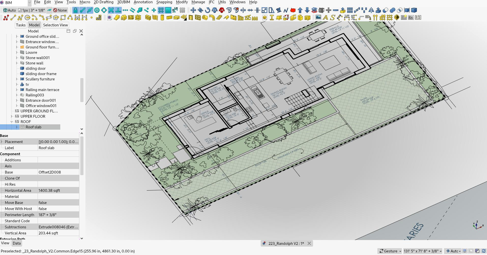
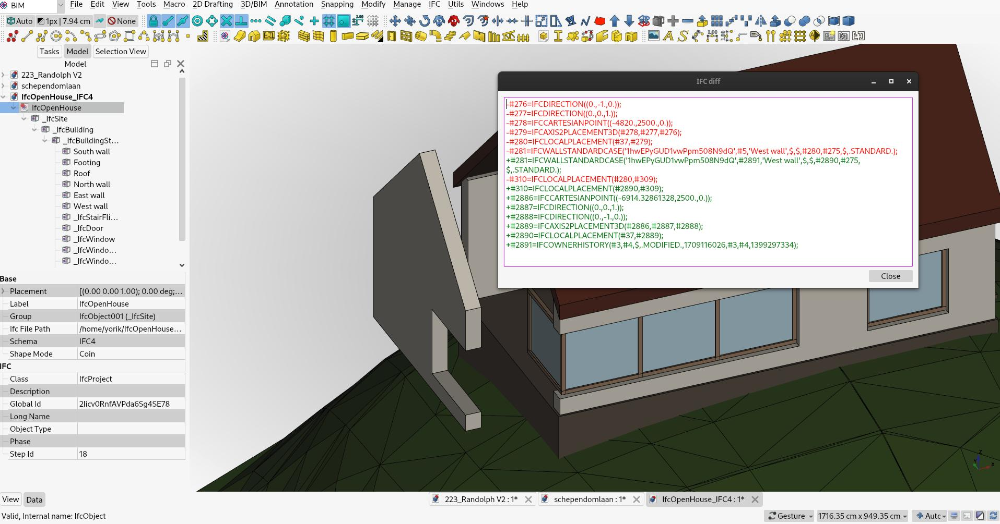
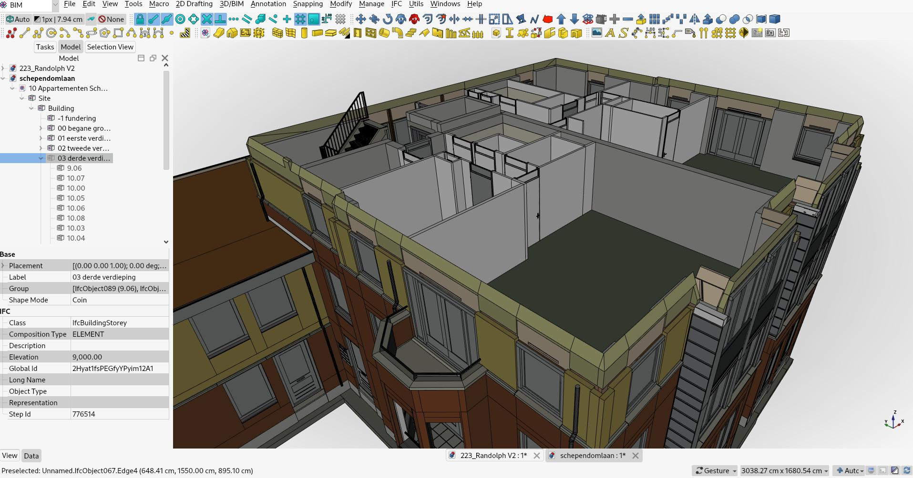
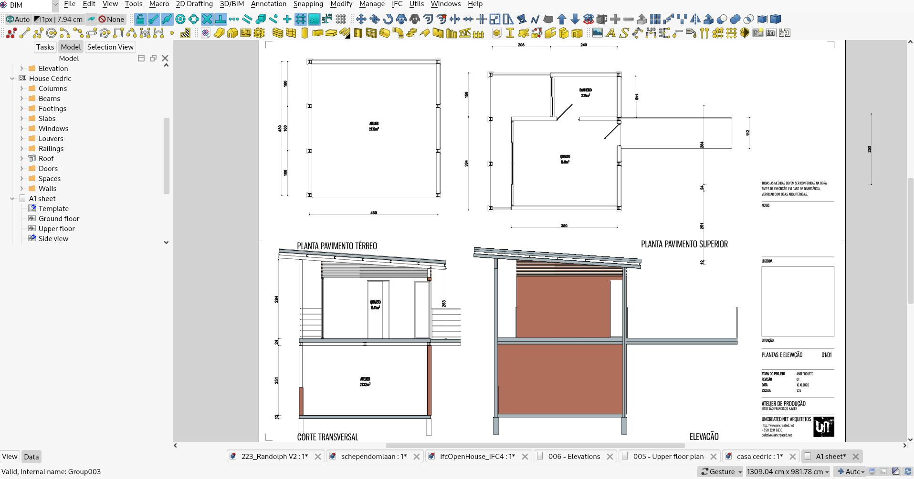

# NativeIFC integration in FreeCAD

This plan is part of the [Native IFC for FreeCAD project at NLNet](https://nlnet.nl/project/FreeCAD-IFC/). See also the [2023 roadmap](roadmap2023.md) and the [weekly (hopefully) development notes](https://yorik.uncreated.net/blog/nativeifc).

### Introduction

This is a plan for a sustained effort to finish the work on the [NativeIFC integration](https://github.com/yorikvanhavre/FreeCAD-NativeIFC) in [FreeCAD](https://freecad.org). [IFC (Industry Foundation Classes)](https://en.wikipedia.org/wiki/Industry_Foundation_Classes) is a truly open, universal and ISO-standardized CAD standard and file format for [BIM](https://en.wikipedia.org/wiki/Building_information_modeling). It is of big importance, specially for a FOSS CAD application, to not only use it but promote it to become the standard it is mesnt . By using IFC natively, FreeCAD is able to produce high-performance IFC files, which can be versioned, reliably compared ("diffable") and where each and every aspect is controllable by the user.

The aim of this plan is to provide a complete, seamless, elegant workflow to create and manipulate building projects from A to Z using a [native IFC](https://github.com/brunopostle/ifcmerge/blob/main/docs/whitepaper.rst) workflow in FreeCAD. This workflow can broadly be divided into the **nine categories** below.

Most of the core functionality needed to perform the tasks below is already implemented in FreeCAD. In this phase, special care will be taken to refine the workflows and take the needed time to reflect and provide the best possible user experience (UX). As the FreeCAD original creator puts it, CAD is mostly about interface. This will be the guideline all along the work shown in this plan.

### 1. Opening and saving IFC files

Opening existing IFC files typically should "just work". The IFC file contains everything that is needed to decide how the file should be opened. By default, the user should need to define nothing. The basic file structure should be shown to the user. Saving files should work the same way, it should be implicit when hitting the "save" button. What works already:

- Opening existing files of any IFC version
- The ability to choose how the file contents should be loaded
- Saving IFC files

##### What needs to be done

- [x] A **lock system** should be put in place to allow two different scenarios:     
  1. The user wants to work strictly with IFC objects (strict mode) or 
  2. The user wants to mix IFC and non-IFC (FreeCAD-only) objects (hybrid mode). 
     The user should be able to change between the two modes at any moment in the project development. [b739b77](https://github.com/yorikvanhavre/FreeCAD-NativeIFC/commit/b739b77a7068fe80c92481c519cafa9fb9b76431) - [blog](https://yorik.uncreated.net/blog/2024-003-freecad-news-17)
- [x] A better **display mode** that allows to load all files the same, fastest way. That display mode should handle edges and transparency properly, so there is visually no more need to load the object shapes (heavy) on file load. [dc85ff6](https://github.com/yorikvanhavre/FreeCAD-NativeIFC/commit/dc85ff6123d44e4c773ddad7182f2ed4193a2711) - [37e3d2c](https://github.com/yorikvanhavre/FreeCAD-NativeIFC/commit/37e3d2c2a02ee049891540898923353da94ba346) - [3ff1715](https://github.com/yorikvanhavre/FreeCAD-NativeIFC/commit/3ff1715802d582e4f1c722e8c4010ca10733b80d) - [blog](https://yorik.uncreated.net/blog/2024-002-freecad-news-16)
- [x] An automatic **shape loading mechanism** that seamlessly loads object shapes and geometric properties when needed, for example when they are selected or being edited. [b382938](https://github.com/yorikvanhavre/FreeCAD-NativeIFC/commit/b382938e9facfed61befb644d8d8b7b185d3babe) - [blog](https://yorik.uncreated.net/blog/2024-002-freecad-news-16)
- [x] **Remove the file loading dialog**. All options set in that dialog should be settable at any time later by the user. [a64871a](https://github.com/yorikvanhavre/FreeCAD-NativeIFC/commit/a64871adb06a60b52ff1ccf1b48413731ad4a58c) - [blog](https://yorik.uncreated.net/blog/2024-004-freecad-news-18)
- [x] Integrate both **FreeCAD and IFC save mechanisms** so a user can just press "Save". [18dc454](https://github.com/yorikvanhavre/FreeCAD-NativeIFC/commit/18dc454694b70e61cdfbfa6452acc3f5f161ca5a) - [e996f86](https://github.com/yorikvanhavre/FreeCAD-NativeIFC/commit/e996f86fed6c144b9af6c18037e76717ea9d56dc) - [blog](https://yorik.uncreated.net/blog/2024-004-freecad-news-18)

### 2. Creating files from scratch, and attach existing files

Typically a user should be able to fire up FreeCAD and start throwing ideas and importing data (2D CAD drawings, terrain data, etc...) without thinking IFC. Users should also be able to attach data from other files, without actually import the contents of those files, so they are unmodifiable, and can be removed or updated anytime. What works already:

* Creating new FreeCAD files and turning them into IFC-only files
* Creating IFC projects inside normal FreeCAD files
* Attaching FreeCAD files as external references

##### What needs to be done

- [x] **Refine the lock system** so it handles the following scenarios: 
  1. There is no object in the document, or only IFC objects. Locking and unlocking happens with no needed user interaction
  2. There are non-IFC objects in the document and the user wants to lock the file. The non-IFC objects are converted. This is fully undoable. [b739b77](https://github.com/yorikvanhavre/FreeCAD-NativeIFC/commit/b739b77a7068fe80c92481c519cafa9fb9b76431) [blog](https://yorik.uncreated.net/blog/2024-004-freecad-news-18)
- [x] **Handle project creation**: At some point along the project development, users typically want to "go IFC". They should be halted, be asked which IFC version they want to use, and if they want to work in a locked or unlocked environment. [18dc454](https://github.com/yorikvanhavre/FreeCAD-NativeIFC/commit/18dc454694b70e61cdfbfa6452acc3f5f161ca5a#) [blog](https://yorik.uncreated.net/blog/2024-005-freecad-news-19)
- [x] Create an **advanced external reference object**, that is able to handle not only FreeCAD files but also IFC files and possibly other formats too, such as DXF or mesh formats like OBJ, if possible, based on [App::Link](https://wiki.freecad.org/App_Link) structure. *Update* Using App::Links has been deemed useless because it wouldn't help with other file formats, and mesh formats have been left out because there is no point in using them in a Reference object, better use the Mesh importer directly. [7d098e4803](https://github.com/FreeCAD/FreeCAD/pull/13287) [blog](https://yorik.uncreated.net/blog/2024-005-freecad-news-19)

### 3. Add and modify objects

Currently, users are already able to create BIM objects either directly using BIM tools or by using any other FreeCAD tool and converting these to BIM. Native IFC means the IFC data controls the totality of the object, so this means converting away from the FreeCAD object. However, the maximum should be done so users retain an identical level of control over these objects, before and after the conversion.

Direct creation of BIM objects should be as simple as possible and wherever possible not rely on additional objects so the translation to/from IFC is as seamless as possible. What works already:

- Adding BIM (wall, window,...) and non-BIM objects to a FreeCAD document
- Modifying those objects while non-IFC
- Converting these objects to IFC
- (Partially) Modifying their properties after the conversion to IFC
- Create clones (mapped representation) for non-IFC objects

##### What needs to be done

- [ ] **Redesign the wall tool** to by default work without a baseline, and handle types.
- [ ] **Redesign the window tool**. The window tool is in need of a [larger redesign](https://yorik.uncreated.net/blog/2023-025-new-window-tool), to offer a better user experience at creation and support types.
- [ ] **Redesign the structure tool** to handle types.
- [ ] Create **more geometric properties** of generic extrusions, unions, subtractions and differences.
- [ ] Create (or extend the Draft one) a **graphical edit mode** for IFC objects
- [ ] **Handle cloning** (mapped representations) for IFC objects

### 4. Organize model, classification and types

Organizing the model and its objects is one of the most fundamental operations needed to produce quality BIM models. The IFC standard provides many systems to organize and classify. They should be all available to the FreeCAD user. What works already:

- Creating building structures (building, storey...)
- Organizing (moving) objects into building structures
- Use classification systems for non-IFC objects
- Define quantity sets for non-IFC objects

##### What needs to be done

- [ ] Support **types**. Types allow any IFC object to reference a type that define some of its properties. Then the individual objects can use the type's attributes or define (override) with their own. This is a fundamental mechanism and should be available throughout the BIM project. One should be able to:
  1. Design any kind of object and define it as a type
  2. Turn any existing object into a type
  3. Make any IFC object a child of a type
- [ ] **Handle classification** for IFC objects
- [ ] **Handle quantity sets** for IFC objects

### 5. View, add and modify properties and property sets

Property sets are a very important feature of the IFC standard. It allows to define both standard and custom sets of properties to be attached to individual objects or, more interestingly, to types. Property sets can be large and complicated to manage and inspect. Extra care should be taken to provide a good and efficient workflow. What works already:

- Creating and managing per-object properties and property sets (non-IFC objects)
- Displaying properties for IFC objects

##### What needs to be done

- [ ] Offer a reliable, documented translation between IFC property types and FreeCAD property types
- [ ] Offer a nicer interface to add and remove custom properties
- [ ] Define a clear way to identify IFC-handled property sets

### 6. Produce 2D drawings (plans, sections, etc)

There is already a well-established and relatively efficient workflow to produce 2D drawings suitable for architecture and civil engineering in FreeCAD. However:

1. It is currently a bit too slow and the UX experience is not optimal
2. IFC contains everything to hold 2D drawings data directly inside the model, but this is not used in FreeCAD

##### What needs to be done

- [ ] Allow to **store working planes, 2D data and sheets data** inside the IFC model
- [ ] Design and build a nicer **UX workflow** to produce 2D drawings, based on the current shape2DView -> 2D work -> Techdraw page workflow

### 7. Produce quantity takeoffs and other schedules

It is already possible to extract any kind of data and quantity form any FreeCAD model (BIM or not), and to display the results inside a spreadsheet. However, the result are not stored in the IFC file. Quantity sets are currently not fully supported.

##### What needs to be done

- [ ] Support **quantity sets** and design a good workflow to define and handle them in FreeCAD
- [ ] Design **property set and quantity sets systems** so they can be used to store spreadsheets data

### 8. Merge NativeIFC, BIM and Arch

The BIM/IFC workflow in FreeCAD now depends on 3 modules:

1. The Arch workbench, which is built-in, and contains all basic types and tools
2. The BIM workbench, which is an add-on workbench, contains a more refined interface and tools
3. The NativeIFC module

There is however no more advantages to have these different modules separated. They should be merged into one, in order to provide a good, default, built-in BIM / NativeIFC workbench to FreeCAD.

##### What needs to be done

- [x] Design a reliable **IfcOpenShell download system** so users can verify, download and update their version of IfcOpenShell [bd143fe](https://github.com/FreeCAD/FreeCAD/commit/bd143feae20f97203e9d0526a46706da1150326e) - [blog](https://yorik.uncreated.net/blog/2024-007-freecad-news-21)
- [x] **Retire the Arch workbench**, keep the object structure for backwards compatibility [#13783](https://github.com/FreeCAD/FreeCAD/pull/13783)  - [blog](https://yorik.uncreated.net/blog/2024-007-freecad-news-21)
- [x] **Move all Arch tools to BIM** [#13783](https://github.com/FreeCAD/FreeCAD/pull/13783) - [blog](https://yorik.uncreated.net/blog/2024-007-freecad-news-21)
- [x] **Merge NativeIFC** [#13783](https://github.com/FreeCAD/FreeCAD/pull/13783) - [blog](https://yorik.uncreated.net/blog/2024-007-freecad-news-21)
- [x] **Redesign the BIM workbench toolbars** to occupy less space [#14087](https://github.com/FreeCAD/FreeCAD/pull/14087) - [blog](https://yorik.uncreated.net/blog/2024-008-frreecad-news-22)
- [ ] **Design a better new project wizard** that supports NativeIFC, and allows to be called anytime during the project development. This is postponed because the project wizard creates many 2D elements, so this will be done after item 6.1 (2D support), so we can have a better, proper system that works equally in both IFC/non-IFC modes.
- [x] **Design a better views manager** that integrates more seamlessly in the FreeCAD interface and tree workflow, and allows for easy 3D/2D view switch [#15836](https://github.com/FreeCAD/FreeCAD/pull/15836) - [blog](https://yorik.uncreated.net/blog/2024-009-frreecad-news-23)
- [x] **Redesign icons** that indicate the basic IFC type and indicate if the geometry is shared or not [#14959](https://github.com/FreeCAD/FreeCAD/pull/14959) - [blog](https://yorik.uncreated.net/blog/2024-010-freecad-news-24)

### 9. Documentation and tutorials

A good documentation is fundamental for an efficient workflow and an easier learning curve.

##### What needs to be done

- [ ] Enumerate, verify, harmonize and update all the **documentation of available BIM tools**
- [ ] Provide a quality **NativeIFC workflow tutorial**
- [ ] Provide a quality **Hybrid (FreeCAD + IFC) workflow tutorial**
- [x] Rebuild built-in **example models**: a basic BIM project with structure, section planes and 2D sheets [#14937](https://github.com/FreeCAD/FreeCAD/pull/14937) - [#15443](https://github.com/FreeCAD/FreeCAD/pull/15443) - [310b7ff](https://github.com/yorikvanhavre/FreeCAD-BIM-examples/commit/310b7ffc78c729be5a77e1e4845366ecf69687bf) - [blog](https://yorik.uncreated.net/blog/2024-010-freecad-news-24)
